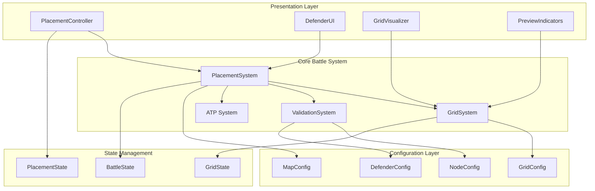

# Technical Design: ImmunWar Placement System and UI Redesign

## Overview

This design implements a comprehensive redesign of ImmunWar's placement mechanics and user interface systems, transforming the current limited placement system (~5 positions per map) into a robust grid-based tower defense framework supporting 40+ placement positions per organ map. The redesign addresses critical limitations including UI corruption, oversimplified pathways, and insufficient strategic depth while maintaining the existing Unity 6 URP 2D architecture and deterministic battle system.

### Design Goals

- **Grid-Based Flexibility**: Replace fixed positioning with a configurable 2D grid system supporting 40+ positions per organ map
- **Strategic Depth**: Introduce strategic nodes, chokepoints, and multi-path routing for meaningful tactical decisions  
- **UI Reliability**: Eliminate defender selection artifacts and corruption while maintaining responsive performance
- **Organ-Specific Layouts**: Create unique strategic challenges for Lung, Stomach, and Brain environments
- **Performance Optimization**: Maintain 60 FPS with up to 30 pathogens and 15 defenders during active placement
- **Accessibility Support**: Implement keyboard navigation, color-blind accessibility, and responsive UI scaling

### Architecture Philosophy

The design follows the existing Unity architecture principles established in the base game:
- **Deterministic Core**: Placement rules remain in pure C# with Unity components adapting state to presentation
- **Event-Driven**: Grid state changes propagate through the existing battle event system
- **ScriptableObject Configuration**: All grid layouts, strategic nodes, and placement rules defined as authored data
- **Object Pooling**: Preview indicators and UI elements use pooling for memory efficiency
- **Separation of Concerns**: UI controllers manage presentation while core systems handle business logic

## Architecture

### System Overview

The placement system redesign introduces five core architectural components that integrate with the existing battle system:



### Component Responsibilities

**PlacementSystem**: Core business logic coordinating placement validation, ATP transactions, and state updates
**GridSystem**: Manages 2D grid representation, node types, occupancy tracking, and strategic node mechanics  
**ValidationSystem**: Enforces placement rules including boundaries, occupancy, ATP costs, and defender restrictions
**PlacementController**: UI interaction handling including mouse/keyboard input, preview management, and visual feedback
**DefenderUI**: Manages defender selection interface, tooltips, availability states, and accessibility features
**GridVisualizer**: Renders grid indicators, strategic node highlights, range previews, and validation feedback
### Integration Points

The redesigned placement system integrates with existing ImmunWar systems through well-defined interfaces:

**BattleController Integration**: Placement commands flow through the existing BattleCommand system with tick-stamped sequencing for deterministic replay support.

**ATP Economy Integration**: Placement costs integrate with the existing ATP system, supporting dynamic pricing for strategic nodes and Energy Cell bonus generation.

**Event System Integration**: Grid state changes publish through the existing BattleEvent system to notify UI controllers, audio systems, and progression tracking.

**Save System Integration**: Grid configurations and placement preferences persist through the existing SaveData DTO with versioned migration support.

## Components and Interfaces

### Core Grid System

#### GridSystem Component

```csharp
public class GridSystem
{
    public struct GridPosition { public int X, Y; }
    
    public struct GridNode
    {
        public GridPosition Position;
        public NodeType Type;
        public bool IsOccupied;
        public string OccupantId;
        public StrategicNodeData StrategyData;
    }
    
    public enum NodeType
    {
        Standard,
        Strategic,
        Restricted,
        Blocked
    }
    
    // Grid query and validation
    public bool IsValidPosition(GridPosition position);
    public GridNode GetNode(GridPosition position);
    public IEnumerable<GridNode> GetNodesInRange(GridPosition center, int range);
    public IEnumerable<GridPosition> GetValidPlacementPositions();
    
    // Strategic node management  
    public IEnumerable<GridNode> GetStrategicNodes();
    public StrategicNodeAdvantage GetStrategicAdvantage(GridPosition position);
    
    // Occupancy management
    public bool TryOccupyPosition(GridPosition position, string defenderId);
    public void ReleasePosition(GridPosition position);
    public string GetOccupantId(GridPosition position);
}
```

#### GridConfiguration ScriptableObject

```csharp
[CreateAssetMenu(menuName = "ImmunWar/Grid Configuration")]
public class GridConfiguration : ScriptableObject
{
    [Header("Grid Dimensions")]
    public int Width = 12;
    public int Height = 8;
    public Vector2 CellSize = new Vector2(1.0f, 1.0f);
    public Vector2 GridOrigin = Vector2.zero;
    
    [Header("Node Definitions")]
    public GridNodeDefinition[] StandardNodes;
    public StrategicNodeDefinition[] StrategicNodes;  
    public RestrictedZoneDefinition[] RestrictedZones;
    
    [Header("Validation Rules")]
    public PlacementRule[] PlacementRules;
    public int MinimumValidPositions = 40;
    public int MinimumStrategicNodes = 8;
}
```

### Placement Validation System

#### ValidationSystem Component

```csharp
public class ValidationSystem
{
    public struct ValidationResult
    {
        public bool IsValid;
        public ValidationFailureReason Reason;
        public string DetailMessage;
        public IEnumerable<string> Suggestions;
    }
    
    public enum ValidationFailureReason
    {
        None,
        OutOfBounds,
        PositionOccupied, 
        InsufficientATP,
        DefenderRestriction,
        DensityLimit,
        PathBlocking
    }
    
    // Primary validation interface
    public ValidationResult ValidatePlacement(PlacementRequest request);
    
    // Specialized validation methods
    public bool ValidateGridBounds(GridPosition position);
    public bool ValidateOccupancy(GridPosition position);
    public bool ValidateATPCost(string defenderId, GridPosition position, int availableATP);
    public bool ValidateDefenderRestrictions(string defenderId, GridPosition position);
    public bool ValidateDensityLimits(string defenderId, GridPosition position);
    public bool ValidatePathBlocking(GridPosition position);
}
```

### Enhanced Path System

#### Multi-Route PathSystem

```csharp
public class PathSystem  
{
    public struct PathRoute
    {
        public string RouteId;
        public Vector2[] Waypoints;
        public RouteType Type;
        public float BaseSpeed;
        public PathSegment[] Segments;
    }
    
    public struct Chokepoint
    {
        public Vector2 Position;
        public string[] ConvergingRoutes;
        public float InfluenceRadius;
        public ChokepointType Type;
    }
    
    public enum RouteType
    {
        Primary,
        Secondary, 
        Alternate,
        Boss
    }
    
    // Route management
    public IEnumerable<PathRoute> GetActiveRoutes();
    public PathRoute GetRoute(string routeId);
    public Vector2 GetRoutePosition(string routeId, float normalizedProgress);
    
    // Chokepoint analysis
    public IEnumerable<Chokepoint> GetChokepoints();
    public IEnumerable<string> GetRoutesInRange(Vector2 position, float range);
    public bool IsStrategicPosition(GridPosition gridPos);
}
```

### Strategic Node System

#### StrategicNodeManager

```csharp
public class StrategicNodeManager
{
    public struct StrategicNodeAdvantage
    {
        public float RangeMultiplier;
        public float DamageBonus;
        public int PathCoverage;
        public bool MultiTargeting;
        public float ATPGenerationBonus;
    }
    
    public enum StrategicNodeType
    {
        HighGround,      // Increased range
        Chokepoint,      // Multi-path coverage  
        PowerNode,       // ATP generation bonus
        AmplifierNode    // Damage/effect bonus
    }
    
    // Strategic node queries
    public StrategicNodeAdvantage GetAdvantage(GridPosition position);
    public IEnumerable<GridPosition> GetAvailableStrategicNodes();
    public float GetPlacementCostMultiplier(GridPosition position);
    
    // Visual feedback  
    public string GetAdvantageDescription(GridPosition position);
    public Color GetNodeHighlightColor(StrategicNodeType type);
}
```
### Enhanced UI System

#### PlacementController Redesign

```csharp
public class PlacementController : MonoBehaviour
{
    public struct PlacementState
    {
        public bool IsActive;
        public string SelectedDefenderId;
        public DefenderRole SelectedRole;
        public GridPosition HoveredPosition;
        public bool PreviewActive;
        public ValidationResult CurrentValidation;
    }
    
    // Input handling
    public void HandleMouseInput(Vector2 screenPosition);
    public void HandleKeyboardInput(KeyCode key);
    public void HandleGridNavigation(Vector2Int direction);
    
    // Selection management
    public void SelectDefender(string defenderId, DefenderRole role);
    public void CancelSelection();
    public void ConfirmPlacement();
    
    // Preview system
    public void UpdatePreview(GridPosition position);
    public void ShowRangePreview(string defenderId, GridPosition position);
    public void HidePreview();
    
    // Accessibility
    public void SetKeyboardNavigationEnabled(bool enabled);
    public void SetHighContrastMode(bool enabled);
    public void SetColorBlindSupport(ColorBlindType type);
}
```

#### DefenderUI Redesign

```csharp
public class DefenderUI : MonoBehaviour
{
    public struct DefenderUIState
    {
        public string DefenderId;
        public bool IsAvailable;
        public bool IsSelected;
        public int Cost;
        public string UnavailableReason;
        public DefenderCapabilities Capabilities;
    }
    
    // State management
    public void UpdateDefenderStates(DefenderUIState[] states);
    public void SetSelectedDefender(string defenderId);
    public void SetATPStatus(int current, int generation, int projected);
    
    // Tooltip system
    public void ShowTooltip(string defenderId, Vector2 position);
    public void HideTooltip();
    public void SetTooltipDuration(float seconds);
    
    // Accessibility
    public void SetKeyboardShortcuts(KeyCode[] shortcuts);
    public void SetContrastMode(bool highContrast);
    public void SetFontScale(float scale);
}
```

### ATP Economy Integration

#### Enhanced ATP System

```csharp
public class EnhancedATPSystem
{
    public struct ATPTransaction
    {
        public string TransactionId;
        public int Amount;
        public ATPTransactionType Type;
        public GridPosition? Position;
        public string DefenderId;
        public int Timestamp;
    }
    
    public enum ATPTransactionType
    {
        PlacementCost,
        StrategicNodeBonus,
        EnergyGeneration, 
        WaveReward,
        FeverBonus
    }
    
    // Enhanced ATP operations
    public bool CanAfford(int cost, GridPosition? position = null);
    public int GetPlacementCost(string defenderId, GridPosition position);
    public void ProcessPlacement(string defenderId, GridPosition position);
    public void ProcessStrategicNodeBonus(GridPosition position);
    
    // Planning mode
    public void QueuePlacement(PlacementOrder order);
    public void ProcessQueuedPlacements();
    public IEnumerable<PlacementOrder> GetPendingQueue();
}
```

## Data Models

### Grid Configuration Data

```csharp
[System.Serializable]
public class GridNodeDefinition
{
    public GridPosition Position;
    public NodeType Type;
    public DefenderRoleMask AllowedRoles;
    public PlacementRestriction[] Restrictions;
}

[System.Serializable] 
public class StrategicNodeDefinition
{
    public GridPosition Position;
    public StrategicNodeType Type;
    public float CostMultiplier = 1.25f;
    public StrategicNodeAdvantage Advantages;
    public string Description;
    public Sprite HighlightSprite;
}

[System.Serializable]
public class RestrictedZoneDefinition  
{
    public GridPosition[] Positions;
    public RestrictionType Type;
    public string Reason;
}
```

### Organ-Specific Configurations

#### Lung Map Configuration

```csharp
[CreateAssetMenu(menuName = "ImmunWar/Organ Maps/Lung Configuration")]
public class LungMapConfiguration : GridConfiguration
{
    [Header("Lung-Specific Features")]
    public AlveoliStructure[] AlveoliPositions;
    public AirwayDefinition[] BranchingAirways;
    public Vector2[] PathogenEntryPoints = new Vector2[4]; // Required: 4 entry points
    
    [Header("Environmental Challenges")]
    public BreathingCycleEffect BreathingCycle;
    public OxygenLevelEffect[] OxygenZones;
}

[System.Serializable]
public class AlveoliStructure
{
    public Vector2 Position;
    public float Radius;
    public AlveoliPlacementRule PlacementRule;
}
```

#### Stomach Map Configuration  

```csharp
[CreateAssetMenu(menuName = "ImmunWar/Organ Maps/Stomach Configuration")]
public class StomachMapConfiguration : GridConfiguration
{
    [Header("Stomach-Specific Features")]
    public DigestiveTractPath MainTract;
    public AcidPoolDefinition[] AcidPools;
    public PeristalsisEffect WaveMotion;
    
    [Header("Chemical Environment")]
    public PHLevelZone[] PHZones;
    public EnzymeActivityArea[] EnzymeZones;
}

[System.Serializable]
public class AcidPoolDefinition
{
    public Vector2[] PoolArea;
    public float AcidStrength;
    public DefenderEffect DefenderImpact;
    public PathogenEffect PathogenImpact;
}
```

#### Brain Map Configuration

```csharp
[CreateAssetMenu(menuName = "ImmunWar/Organ Maps/Brain Configuration")]  
public class BrainMapConfiguration : GridConfiguration
{
    [Header("Brain-Specific Features")]
    public NeuralPathway[] NeuralNetworks;
    public SynapticGap[] SynapticGaps;
    public BrainRegion[] FunctionalRegions;
    
    [Header("Neural Activity")]
    public NeuralActivityPattern[] ActivityPatterns;
    public SynapticPlasticity PlasticityRules;
}

[System.Serializable]
public class SynapticGap
{
    public Vector2 Position;
    public Vector2 Size;
    public SynapticType Type;
    public ChokepointAdvantage Advantage;
}
```
## Correctness Properties

*A property is a characteristic or behavior that should hold true across all valid executions of a system-essentially, a formal statement about what the system should do. Properties serve as the bridge between human-readable specifications and machine-verifiable correctness guarantees.*

### Property 1: Grid Position Count Guarantee
*For any* organ map configuration, the generated placement grid SHALL provide at least 40 valid placement positions regardless of anatomical constraints or environmental hazards.
**Validates: Requirements 1.1, 5.6**

### Property 2: Preview Indicator Consistency  
*For any* valid grid position, hovering over that position SHALL consistently display the appropriate placement preview indicator without visual artifacts or delays.
**Validates: Requirements 1.2**

### Property 3: Validation Error Accuracy
*For any* invalid placement attempt, the validation system SHALL display a specific error message that accurately explains the restriction preventing placement.
**Validates: Requirements 1.3, 7.2**

### Property 4: Strategic Node Distribution
*For any* organ map configuration, the placement grid SHALL include at least 8 strategic nodes with distinct tactical advantages distributed across the map area.
**Validates: Requirements 2.1, 2.3**

### Property 5: ATP Transaction Integrity
*For any* successful defender placement, the ATP system SHALL deduct the exact placement cost (including strategic node premiums) once and only once per transaction.
**Validates: Requirements 1.6, 6.1**

### Property 6: Path System Route Guarantee
*For any* organ map configuration, the path system SHALL generate at least 3 distinct pathogen routes from entry points to organ center with at least 2 chokepoint convergences.
**Validates: Requirements 3.1, 3.2**

### Property 7: UI Rendering Reliability
*For any* screen resolution between 1280×720 and 1920×1080, the defender UI SHALL display all six defender types without texture corruption, layout overlap, or missing visual elements.
**Validates: Requirements 4.1, 4.6**

### Property 8: Performance Response Timing
*For any* placement command during active battle, the placement controller SHALL acknowledge the command within 250ms and update UI state within 100ms regardless of current pathogen/defender count.
**Validates: Requirements 8.1, 8.2**

### Property 9: Accessibility Input Support
*For any* placement operation, the system SHALL support both mouse and keyboard navigation with equivalent functionality and visual feedback.
**Validates: Requirements 9.1, 9.2, 9.3**

### Property 10: Save State Preservation
*For any* valid placement configuration and UI preferences, the save system SHALL preserve the complete state accurately across session boundaries and restore it identically upon load.
**Validates: Requirements 10.1, 10.3**

### Property 11: Density Limitation Enforcement
*For any* Energy Cell placement attempt, the ATP system SHALL prevent placement that would result in more than 1 Energy Cell within any 3×3 grid area.
**Validates: Requirements 6.4**

### Property 12: Chokepoint Strategic Value
*For any* strategic node positioned at a chokepoint, defenders placed there SHALL gain multi-path coverage advantages that affect at least 2 distinct pathogen routes.
**Validates: Requirements 2.3, 3.4**

## Error Handling

### Placement Error Recovery

The placement system implements comprehensive error handling with graceful degradation:

#### Validation Failures
- **Out of Bounds**: Display grid boundary indicators and suggest nearest valid positions
- **Position Occupied**: Highlight occupant and offer upgrade/replacement options where applicable  
- **Insufficient ATP**: Show required cost, current ATP, and estimated time to affordability
- **Density Violations**: Visualize restricted area and suggest alternative positions
- **Path Blocking**: Warn about strategic consequences and confirm intentional placement

#### Performance Degradation
- **Frame Rate Drops**: Reduce preview detail and disable non-essential visual effects
- **Memory Pressure**: Aggressively pool UI elements and defer non-critical updates
- **Input Lag**: Queue commands with visual acknowledgment and process when performance recovers

#### Corruption Recovery
- **UI Artifact Detection**: Automatically refresh affected UI panels and reset rendering state
- **Grid State Corruption**: Validate grid integrity and rebuild from last known good state
- **Save Data Issues**: Attempt repair, fallback to defaults, and preserve user preferences where possible

### Audio Error Handling

```csharp
public class PlacementAudioManager
{
    // Fallback audio cues when primary sounds fail
    public void PlayPlacementFeedback(PlacementResult result)
    {
        switch (result.Type)
        {
            case PlacementResultType.Success:
                PlayWithFallback(successSound, genericPositiveSound);
                break;
            case PlacementResultType.InvalidPosition:
                PlayWithFallback(errorSound, genericNegativeSound);
                break;
            case PlacementResultType.InsufficientATP:
                PlayWithFallback(atpWarningSound, genericWarningSound);
                break;
        }
    }
    
    private void PlayWithFallback(AudioClip primary, AudioClip fallback)
    {
        if (primary && audioSource.enabled)
            audioSource.PlayOneShot(primary);
        else if (fallback)
            audioSource.PlayOneShot(fallback);
    }
}
```
## Testing Strategy

### Property-Based Testing Approach

The placement system redesign uses a dual testing strategy combining property-based testing for universal correctness guarantees with targeted unit tests for specific scenarios and edge cases.

#### Property Test Configuration
- **Minimum Iterations**: 100 per property test (due to randomization)  
- **Test Framework**: Unity Test Framework with custom property test runners
- **Generator Library**: Custom generators for GridPosition, DefenderConfig, and OrganMap scenarios
- **Tag Format**: `Feature: immunwar-placement-ui-redesign, Property {number}: {property_text}`

#### Property Test Implementation

```csharp
[TestFixture]
public class PlacementSystemPropertyTests
{
    [Test, Repeat(100)]
    [Tag("Feature: immunwar-placement-ui-redesign, Property 1: Grid Position Count Guarantee")]
    public void Property_GridPositionCountGuarantee()
    {
        // Generate random organ map with varying constraints
        var organMap = GenerateRandomOrganMap();
        var gridSystem = new GridSystem(organMap.GridConfig);
        
        // Verify minimum position count regardless of constraints
        var validPositions = gridSystem.GetValidPlacementPositions().Count();
        Assert.GreaterOrEqual(validPositions, 40, 
            $"Generated only {validPositions} valid positions, minimum required: 40");
    }
    
    [Test, Repeat(100)]
    [Tag("Feature: immunwar-placement-ui-redesign, Property 5: ATP Transaction Integrity")]
    public void Property_ATPTransactionIntegrity()
    {
        // Generate random placement scenario
        var initialATP = Random.Range(100, 500);
        var defenderId = GenerateRandomDefenderId();
        var position = GenerateRandomValidPosition();
        var expectedCost = GenerateExpectedCost(defenderId, position);
        
        var atpSystem = new EnhancedATPSystem(initialATP);
        var placementSystem = new PlacementSystem(atpSystem);
        
        // Perform placement and verify exact ATP deduction
        var result = placementSystem.TryPlace(defenderId, position);
        
        if (result.Success)
        {
            Assert.AreEqual(initialATP - expectedCost, atpSystem.Current,
                $"ATP deduction mismatch. Expected: {expectedCost}, Actual: {initialATP - atpSystem.Current}");
        }
    }
}
```

### Unit Testing Strategy

#### Grid System Tests
```csharp
[TestFixture]
public class GridSystemUnitTests
{
    [Test]
    public void LungMap_HasExactlyFourEntryPoints()
    {
        var lungConfig = Resources.Load<LungMapConfiguration>("Maps/LungMap");
        Assert.AreEqual(4, lungConfig.PathogenEntryPoints.Length);
    }
    
    [Test]  
    public void StrategicNodes_ProvideCorrectCostMultiplier()
    {
        var gridSystem = CreateTestGridSystem();
        var strategicPosition = gridSystem.GetStrategicNodes().First().Position;
        var standardCost = 100;
        
        var strategicCost = gridSystem.GetPlacementCost("TestDefender", strategicPosition);
        var expectedCost = Mathf.RoundToInt(standardCost * 1.25f);
        
        Assert.AreEqual(expectedCost, strategicCost);
    }
}
```

#### UI System Tests
```csharp
[TestFixture]
public class DefenderUIUnitTests
{
    [Test]
    public void DefenderUI_ShowsAllSixTypes_WithoutCorruption()
    {
        var defenderTypes = new[] { "Macrophage", "T-Cell", "B-Cell", "NK", "Energy", "Platelet" };
        var ui = CreateTestDefenderUI();
        
        foreach (var type in defenderTypes)
        {
            var icon = ui.GetDefenderIcon(type);
            Assert.IsNotNull(icon, $"Missing icon for defender type: {type}");
            Assert.IsTrue(icon.texture.isReadable, $"Corrupted texture for: {type}");
        }
    }
    
    [Test]
    public void KeyboardShortcuts_SelectCorrectDefenders()
    {
        var ui = CreateTestDefenderUI();
        
        for (int i = 1; i <= 6; i++)
        {
            ui.HandleKeyPress(KeyCode.Alpha0 + i);
            var selectedType = ui.GetSelectedDefenderType();
            Assert.AreEqual(GetExpectedDefenderType(i), selectedType);
        }
    }
}
```

### Performance Testing

#### Load Testing Configuration
```csharp
[TestFixture]
public class PlacementPerformanceTests
{
    [Test]
    public void PlacementController_RespondsWithin250ms_UnderLoad()
    {
        var scenario = CreateHighLoadScenario(30, 15); // 30 pathogens, 15 defenders
        var placementController = CreateTestController(scenario);
        
        var stopwatch = System.Diagnostics.Stopwatch.StartNew();
        placementController.HandlePlacementCommand(GenerateTestCommand());
        stopwatch.Stop();
        
        Assert.Less(stopwatch.ElapsedMilliseconds, 250, 
            "Placement command acknowledgment exceeded 250ms performance target");
    }
    
    [Test]
    public void GridRendering_Maintains60FPS_DuringActivePlacement()
    {
        var frameCounter = new FrameRateCounter();
        var testDuration = 5.0f; // seconds
        var scenario = CreateMaxLoadScenario();
        
        StartCoroutine(MeasureFrameRateDuringPlacement(frameCounter, testDuration));
        
        Assert.GreaterOrEqual(frameCounter.AverageFrameRate, 60.0f,
            $"Frame rate dropped to {frameCounter.AverageFrameRate:F1} FPS during placement");
    }
}
```

### Integration Testing

#### Save System Integration
```csharp
[TestFixture]
public class PlacementSaveIntegrationTests
{
    [Test]
    public void PlacementState_SurvivesMultipleSaveLoadCycles()
    {
        var originalState = CreateComplexPlacementState();
        var saveSystem = new SaveSystem();
        
        // Test 20 save/load cycles as specified in quickstart
        for (int cycle = 0; cycle < 20; cycle++)
        {
            saveSystem.SavePlacementState(originalState);
            var loadedState = saveSystem.LoadPlacementState();
            
            AssertPlacementStatesEqual(originalState, loadedState, 
                $"State corruption detected in save/load cycle {cycle + 1}");
        }
    }
}
```

### Accessibility Testing

```csharp
[TestFixture]
public class AccessibilityTests
{
    [Test]
    public void UIElements_MeetContrastRequirements()
    {
        var ui = CreateTestUI();
        var contrastChecker = new ContrastRatioChecker();
        
        foreach (var textElement in ui.GetAllTextElements())
        {
            var ratio = contrastChecker.CalculateRatio(
                textElement.color, textElement.backgroundColor);
            
            Assert.GreaterOrEqual(ratio, 4.5f, 
                $"Contrast ratio {ratio:F1}:1 below 4.5:1 requirement for element: {textElement.name}");
        }
    }
    
    [Test]
    public void ColorBlindSupport_UsesShapeAndPatternDifferences()
    {
        var indicators = CreateTestPlacementIndicators();
        
        foreach (var indicator in indicators)
        {
            Assert.IsTrue(indicator.HasShapeDifferentiation || indicator.HasPatternDifferentiation,
                $"Indicator {indicator.Type} relies solely on color for differentiation");
        }
    }
}
```
## Implementation Phases

### Phase 1: Core Grid Foundation (Week 1-2)

**Objectives**: Establish the fundamental grid system and basic placement mechanics
- Implement `GridSystem` component with configurable dimensions and node types
- Create `GridConfiguration` ScriptableObject system for authored grid definitions
- Develop `ValidationSystem` for basic placement rule enforcement
- Build `PlacementController` MVP with mouse input and basic preview functionality
- Integrate with existing `BattleState` and command system

**Deliverables**:
- Grid generation supporting 40+ valid positions per map
- Basic placement validation (bounds, occupancy, ATP cost)
- Mouse-based placement with visual preview indicators
- Integration tests with existing battle system

**Acceptance Criteria**:
- Property tests pass for grid position count guarantee (Property 1)
- Basic placement validation works correctly (Property 3)
- Performance maintains target response times (Property 8)

### Phase 2: Strategic Node System (Week 3)

**Objectives**: Implement strategic positioning mechanics and enhanced tactical options
- Develop `StrategicNodeManager` component with advantage calculation
- Create strategic node configuration system with cost multipliers
- Implement visual differentiation and tooltip system for strategic positions
- Add strategic node bonus effects to ATP and combat systems

**Deliverables**:
- Strategic node generation with minimum 8 nodes per map
- Cost multiplier system (25% premium for strategic positions)
- Strategic advantage effects (range, damage, multi-path coverage)
- Enhanced tooltip system showing tactical information

**Acceptance Criteria**:
- Strategic node distribution meets requirements (Property 4)
- ATP transaction integrity includes strategic node premiums (Property 5)
- Chokepoint strategic value provides multi-path coverage (Property 12)

### Phase 3: Enhanced UI System (Week 4)

**Objectives**: Redesign defender selection UI and eliminate visual artifacts
- Rebuild `DefenderUI` component with artifact-resistant rendering
- Implement accessibility features (keyboard navigation, high contrast, color-blind support)
- Add comprehensive tooltip system with defender capabilities
- Create responsive layout system for multiple screen resolutions

**Deliverables**:
- Artifact-free defender selection interface for all six defender types
- Keyboard navigation with hotkeys (1-6 keys for rapid selection)
- Accessibility compliance (contrast ratios, color-blind patterns)
- Responsive UI supporting 1280×720 to 1920×1080 resolutions

**Acceptance Criteria**:
- UI rendering reliability across all supported resolutions (Property 7)
- Accessibility input support with equivalent functionality (Property 9)
- Performance maintains UI update timing requirements (Property 8)

### Phase 4: Multi-Path Route System (Week 5)

**Objectives**: Implement complex pathogen routing with strategic chokepoints
- Develop enhanced `PathSystem` with multi-route support
- Create chokepoint identification and strategic positioning algorithms
- Implement pathogen distribution across multiple routes
- Add route-specific tactical considerations and timing elements

**Deliverables**:
- Multi-route path system with minimum 3 routes per organ map
- Chokepoint system with minimum 2 convergence points per map
- Pathogen distribution logic based on wave configuration
- Route complexity variation for timing-based tactical decisions

**Acceptance Criteria**:
- Path system route guarantee meets minimum requirements (Property 6)
- Chokepoint strategic positioning rewards multi-path coverage (Property 12)
- Pathogen distribution works correctly across all route configurations

### Phase 5: Organ-Specific Implementations (Week 6-7)

**Objectives**: Create unique strategic layouts for each organ environment
- Implement `LungMapConfiguration` with branching airways and 4 entry points
- Develop `StomachMapConfiguration` with acid pools and digestive tract mechanics
- Create `BrainMapConfiguration` with neural pathways and synaptic gaps
- Add organ-specific environmental effects and placement challenges

**Deliverables**:
- Lung map: branching airways, 4 pathogen entries, alveoli placement challenges
- Stomach map: digestive tract paths, acid pools affecting placement/pathogens
- Brain map: neural pathway networks, synaptic gap chokepoints
- Environmental hazards and organ-specific strategic considerations

**Acceptance Criteria**:
- Each organ map maintains minimum position/node requirements (Property 1, 4)
- Organ-specific features create unique tactical challenges
- Environmental effects properly integrate with placement and pathogen systems

### Phase 6: Performance Optimization (Week 8)

**Objectives**: Achieve target performance with maximum enemy/defender counts
- Implement object pooling for all preview indicators and UI elements
- Optimize grid rendering and validation algorithms for 60 FPS target
- Add performance monitoring and adaptive quality systems
- Conduct load testing with 30 pathogens and 15 defenders

**Deliverables**:
- Object pooling system for memory efficiency
- Performance monitoring and profiling tools
- Adaptive quality system for graceful performance degradation
- Load testing suite and performance validation

**Acceptance Criteria**:
- Performance response timing under maximum load (Property 8)
- Memory efficiency through object pooling
- 60 FPS maintenance during intensive placement scenarios

### Phase 7: Save System Integration (Week 9)

**Objectives**: Integrate placement preferences and state with existing save system
- Extend `SaveData` DTO with placement preferences and UI customization
- Implement grid state persistence and restoration
- Add save data migration for grid layout updates
- Create corruption recovery and fallback systems

**Deliverables**:
- Placement preference persistence (hotkeys, UI layout)
- Grid state save/load with exact restoration
- Battle statistics storage including placement efficiency metrics
- Save data migration and corruption recovery

**Acceptance Criteria**:
- Save state preservation across session boundaries (Property 10)
- Migration system supports grid layout updates
- Corruption recovery provides graceful fallback to defaults

### Phase 8: Polish and Accessibility (Week 10)

**Objectives**: Complete accessibility features and final quality improvements
- Implement comprehensive accessibility compliance
- Add audio feedback system for placement actions
- Create tutorial system for new placement mechanics
- Conduct final testing and bug resolution

**Deliverables**:
- Complete accessibility compliance (contrast, color-blind support, keyboard navigation)
- Audio feedback system with fallback sounds
- Interactive tutorial for new grid-based placement
- Comprehensive test coverage and documentation

**Acceptance Criteria**:
- All property tests pass consistently
- Accessibility requirements fully implemented
- Performance targets achieved under all test conditions
- Integration tests pass with existing battle system

## Risk Mitigation

### Technical Risks

**Grid Performance Scalability**: 
- *Risk*: Grid calculations may not scale to 40+ positions with complex validation
- *Mitigation*: Implement spatial partitioning and caching for grid queries; use object pooling for UI elements
- *Fallback*: Reduce grid resolution or implement adaptive quality system

**UI Artifact Regression**:
- *Risk*: New UI system may reintroduce texture corruption issues  
- *Mitigation*: Use separate render targets and implement artifact detection/recovery
- *Fallback*: Implement automatic UI refresh when corruption detected

**Save Data Compatibility**:
- *Risk*: Grid state changes may break existing save file compatibility
- *Mitigation*: Implement versioned migration system with comprehensive fallback
- *Fallback*: Provide manual reset option with preservation of campaign progress

### Integration Risks

**Battle System Interference**:
- *Risk*: Placement system changes may affect existing combat mechanics
- *Mitigation*: Maintain existing battle state interfaces and use event-driven integration
- *Fallback*: Implement placement system toggle for emergency rollback

**Performance Impact**:
- *Risk*: Enhanced grid system may impact overall game performance
- *Mitigation*: Continuous profiling and adaptive quality systems
- *Fallback*: Implement performance-based feature degradation

### User Experience Risks

**Learning Curve Steepness**:
- *Risk*: Complex grid system may overwhelm existing players
- *Mitigation*: Implement progressive tutorial and visual guide system
- *Fallback*: Provide "simple mode" with reduced grid complexity

**Accessibility Gaps**:
- *Risk*: New UI may not meet all accessibility requirements
- *Mitigation*: Early accessibility testing and compliance verification
- *Fallback*: Implement high-contrast mode and enlarged UI options